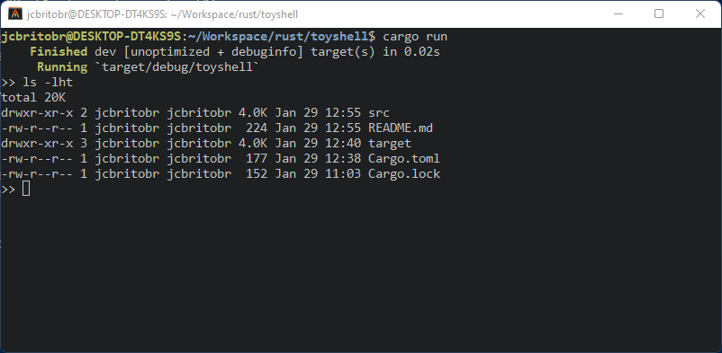

# Toy Shell Written in Rust
This is a simple toy shell written in Rust language with porpose of learning system programming and process management.

* Compile
```
$ cargo build
```

* Run
```
jcbritobr@DESKTOP-DT4KS9S:~/Workspace/rust/toyshell$ cargo run
    Finished dev [unoptimized + debuginfo] target(s) in 0.02s
     Running `target/debug/toyshell`
>> ls -lht
total 20K
drwxr-xr-x 2 jcbritobr jcbritobr 4.0K Jan 29 12:55 src
-rw-r--r-- 1 jcbritobr jcbritobr  224 Jan 29 12:55 README.md
drwxr-xr-x 3 jcbritobr jcbritobr 4.0K Jan 29 12:40 target
-rw-r--r-- 1 jcbritobr jcbritobr  177 Jan 29 12:38 Cargo.toml
-rw-r--r-- 1 jcbritobr jcbritobr  152 Jan 29 11:03 Cargo.lock
>>
```



